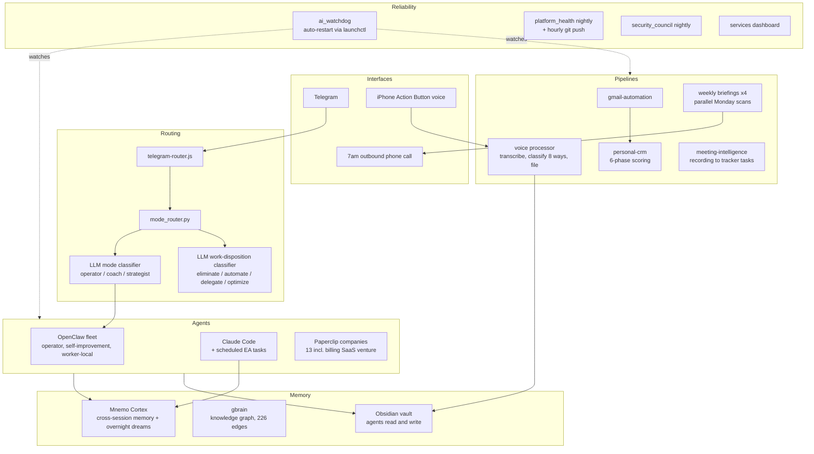

# The Machine

62 scheduled services and roughly 90 agents on one Mac Studio,
running my work, health, research, and two software ventures. This repo is the map: what runs,
how the pieces connect, and which parts have public code.

The configs and data stay private for obvious reasons. The architecture,
the design decisions, and a good amount of the code do not. Where a
component has a public repo, it is linked.

## The whole thing on one page

Local models (Ollama, MLX) handle mechanical work at zero marginal cost.
Judgment tasks escalate to cloud models by explicit routing policy. The
split is benchmarked, not vibes: local decode is fast enough for
classification and transcription; reasoning goes to Claude.

## Case studies

The stories that explain how this machine came to exist:

- [The Assessment That Became an Operating System](case-studies/01-assessment-driven-agents.md) -
  how a psychometric profile became the design constraints for an agent fleet
- [Every Agent Wakes Up Knowing What the Others Did](case-studies/02-memory-spine.md) -
  building cross-agent memory, and everything that broke on the way
- [One Sentence In, One Company Out](case-studies/03-psychbill-idea-to-company.md) -
  how one logged sentence became PsychBill, through the overnight queue,
  a PRD, a revenue model, and an agent company

## The systems

### 1. Memory spine
Every AI session starts knowing what previous sessions learned. Four
Claude Code hooks wire it: session start pulls context, a pre-search hook
checks the local knowledge base before any web search, post-tool activity
syncs back, session end audits. An overnight job synthesizes the day
across all agents, so each one wakes up briefed on what the others did.
Built on Mnemo Cortex and gbrain (both third-party open source; I run,
integrate, and extend them, I did not write them).

### 2. Message routing
One Telegram thread is the interface to everything. Each message hits two
LLM classifiers before any conversation logic: what mode does this need
(operator, coach, strategist), and what should happen to the work
itself (eliminate, automate, delegate, optimize). The router maps the
answer to an agent and a model. Public code: [personal-scripts](https://github.com/JustinTSmith/personal-scripts)
(`mode_router.py`, `mode_classifier_llm.py`, `telegram-router.js`).

### 3. Voice pipeline
One press of the iPhone Action Button. Audio lands in iCloud, a watcher
transcribes it, an LLM classifies it into one of 8 categories, and it
files itself into the right vault folder. Seconds, no manual filing.
Public code: `obsidian_voice_processor.py` in personal-scripts.

### 4. Briefing chain
The same intelligence, delivered where I will actually consume it: a
Telegram message at 6am, an outbound phone call at 7am (script reads the
vault, rewrites in a coach persona, synthesizes audio, Twilio dials), and
four parallel weekly scans every Monday covering AI infrastructure,
sales signals, competitors, and client verticals. Public output:
[weekly-briefings](https://github.com/JustinTSmith/weekly-briefings).
Public code: `twilio_morning_call.py` in personal-scripts.

### 5. Relationship pipeline
Gmail and Calendar feed a 6-phase pipeline: fetch, hard filters, AI
classification, scoring, and a learning loop that remembers every
correction. Weekly digest, monthly iMessage relationship analysis,
automated birthday outreach drafted from real communication history.
Public code: [personal-crm](https://github.com/JustinTSmith/personal-crm).

### 6. Life OS
Identity-driven daily planning: tasks scored against a weighted value
hierarchy, energy-gated operating modes (RECOVERY / BUILD / SPRINT), one
primary objective per day, weekly review. The scoring is deterministic
Python; the reasoning is an LLM following a runbook. Public code:
[Life-Operating-System](https://github.com/JustinTSmith/Life-Operating-System).

### 7. Meeting intelligence
Recordings are polled, transcripts extracted, action items pulled with
owners and dates, tasks created in the tracker. No manual review step by
design.

### 8. Agent companies
13 companies on Paperclip, each a workspace where agents hold roles,
work issues, and hand off to each other: the billing SaaS venture, a
medical council, an equity research desk, and staffed professional
teams (systems 13 through 15 below). Roughly 90 agents in total. I wrote
the OpenRouter adapter that gives every agent a real multi-turn
tool-calling loop, API tools, and approval gating.

### 9. Self-healing layer
A watchdog daemon monitors the AI services and restarts them through
launchctl when they die. Nightly platform health checks commit their
reports hourly. A nightly security review scans for drift. Two live
dashboards show the fleet. The design goal: I should find out something
broke from a log entry, not from silence.

### 10. Local inference
Ollama and MLX serve local models for classification, transcription, and
TTS ([qwen3-tts](https://github.com/JustinTSmith/qwen3-tts), plus a
[voice finetuning pipeline](https://github.com/JustinTSmith/voice-finetune)).
Benchmarked against each other before choosing what runs where.

### 11. Skill compiler
Books become agent behavior. A converter skill
([book-to-skill](https://github.com/JustinTSmith/ai-operator-skills))
ingests any document (PDF, EPUB, DOCX, and more) and extracts structure
rather than summary: named frameworks, actionable principles, techniques,
anti-patterns, and the author's voice, layered into a skill an agent
loads on demand. The proof it works is that the output supervises me:
one book-derived skill auto-triggers whenever I review goals or weekly
plans and checks every item against the book's framework. Reading a book
once now leaves a permanent, executable residue in the fleet.

### 12. Goal engine
Goal setting runs as infrastructure, not intention. An interactive skill
walks me through a psychologically grounded definition process built on
Kegan and Lahey's Immunity to Change four-column analysis: vivid vision,
anti-vision, identity requirements, and the hidden competing commitments
that kill goals from below. It encodes my documented failure modes as
design constraints (novelty chasing, over-designing systems instead of
executing them) and writes the finished goal document into the vault,
where the weekly planner decomposes it into priorities, the daily
scheduler slots tasks onto the calendar, and the accountability agent
checks in three times a day and reviews weekly. A goal here is not a
wish; it is a config file with a supervision chain.

### 13. Medical council
Twenty years of chronic fatigue with no diagnosis is a research problem
disguised as a medical one. I stood up a company of specialist agents:
an internist, a neurologist, an immunologist, an endocrinologist, a
psychiatrist, and a lead who runs the case. Each works the same evidence
from its own discipline, they argue, and the lead forces a written
consensus with dissent recorded rather than smoothed away.

The output is a structured differential with mechanisms, probability
ratings, and a ranked test list, written to be handed to an actual
physician. That framing is the whole design: the council produces
better-prepared questions, not answers. Every report says so. What it
replaced was me arriving at appointments with a vague complaint and
twenty years of scattered notes.

The generalizable pattern, and the reason it is here: multi-specialist
adversarial review beats a single generalist agent on any problem where
the failure mode is a blind spot rather than a lack of information.

### 14. Equity research desk
The busiest company in the fleet by an order of magnitude. Analyst agents
work the same securities from deliberately incompatible philosophies (a
value discipline, technical, fundamentals, sentiment), score conviction
independently, and a synthesis agent assembles a consensus matrix showing
where all four agree and where they split. Disagreement is the product;
a 4-of-4 agreement means something precisely because the analysts were
built to argue.

Output is real analyst work: signal reports, catalyst deep dives, and
ranked shortlists with entry logic, published to PDF. It is the same
adversarial-panel architecture as the medical council, pointed at a
domain where being wrong is measurable.

### 15. Professional service teams
Beyond the ventures, the fleet includes staffed teams for functions I
would otherwise buy: a product-management toolkit team where a legal
specialist drafts NDAs and privacy policies and hands off to an editor
before anything ships, and role-based venture teams (CEO, CTO, engineer,
product owner, UX researcher) staffing the billing SaaS companies.

Each agent has explicit instructions covering where work arrives from,
what it produces, who it hands off to, and what triggers it. That
four-part contract is what makes a set of agents an organization instead
of a group chat. The legal agent's instructions end by requiring it to
recommend qualified human counsel, which is the kind of boundary that
has to be written into the role, not hoped for.

## Numbers

- 62 registered LaunchAgents and cron jobs
- 14 services resident in memory right now (agents, gateways, databases,
  dashboards)
- 4 parallel weekly intelligence scans
- 8 voice-note categories, filed automatically
- 3 redundant triggers on the voice pipeline alone
- 13 agent companies, roughly 90 agents, from 3-agent teams to a 48-agent
  professional services org

## The pattern worth stealing

Three of these systems (medical council, equity desk, and the goal
engine's supervision chain) are the same architecture pointed at
different problems: **give several agents genuinely incompatible
priors, make them work the same evidence independently, then force a
written synthesis that records dissent instead of averaging it away.**

One agent asked to "consider multiple perspectives" produces a bland
consensus, because it is one prior wearing costumes. Five agents with
real disciplinary commitments produce disagreement, and the
disagreement is the signal. That is the most portable thing I have
learned building any of this, and it transfers directly to product
decisions, technical review, and diligence.

## What I learned building this

- Watchdogs are not optional. Anything that runs unattended will
  eventually die silently; the question is whether you designed for it.
- Memory changes agent behavior more than model choice does. A mid-tier
  model that remembers last week beats a frontier model with amnesia for
  most daily work.
- Route by classification, not by app. One inbox, one thread, one router
  beats twelve apps.
- Local-first is an economics decision, not an ideology. Classification
  and transcription are free at the margin; judgment is worth paying for.
