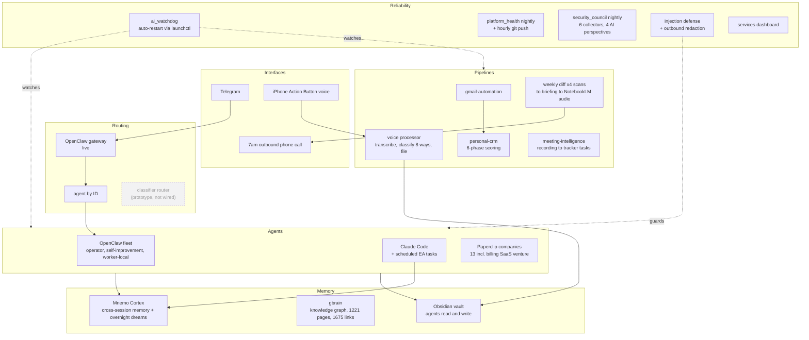

# The Machine

73 scheduled jobs and roughly 90 agents on one Mac Studio, running my
work, health, research, and two software ventures. This repo is the map:
what runs, how the pieces connect, and which parts have public code.

I have worked on AI products for close to a decade: an AI bidding engine
at Acquisio in 2016, a portfolio of 12 AI startups at Creative
Destruction Lab alongside Mila in 2017, two ML models shipped to
production at Officevibe in 2019, and the MLOps process behind a second
production team at Workhuman in 2021. What changed in 2025 is that I
started building the systems myself instead of directing the people who
build them. This is what that year produced.

The configs and data stay private for obvious reasons. The architecture,
the design decisions, and a good amount of the code do not. Where a
component has a public repo, it is linked.

## The whole thing on one page



Local models (Ollama, MLX) handle mechanical work at zero marginal cost.
Judgment escalates to cloud models by an explicit routing policy. I set
that line with a 20-trial harness rather than by intuition: it put the
local briefing agent at roughly 65% all-axes pass, and the dominant
failure was a silent no-op rather than a fabrication. Some pipelines
split a single job across both.

## Start here

**[The Machine](the-machine.md)** is the long-form tour: eight chapters
covering the whole system, what it taught me, and what broke. Read that
first if you want the story rather than the map.

## Case studies

The deep dives behind the essay:

- [The Assessment That Became an Operating System](case-studies/01-assessment-driven-agents.md) -
  how a psychometric profile became the design constraints for an agent fleet
- [Every Agent Wakes Up Knowing What the Others Did](case-studies/02-memory-spine.md) -
  building cross-agent memory, and everything that broke on the way
- [One Sentence In, One Company Out](case-studies/03-psychbill-idea-to-company.md) -
  how one logged sentence became PsychBill, through the overnight queue,
  a PRD, a revenue model, and an agent company
- [I Gave Agents My Email and Shell Access. Then I Designed for It.](case-studies/04-agent-security.md) -
  two-stage prompt injection defense, outbound redaction, and why the
  scanner must never judge for itself
- [Cheap Models, Expensive Mistakes](case-studies/05-local-model-routing.md) -
  benchmarking local models against frontier ones, a 20-trial reliability
  harness, and where the local-to-cloud line actually belongs
- [I Built the Product Org I Used to Hire](case-studies/06-product-compass.md) -
  a 48-agent product organization with a CPO agent, and what it revealed
  about which parts of product management specify and which do not

## The systems

### 1. Memory spine
Every AI session starts knowing what previous sessions learned. Four
Claude Code hooks wire it: session start pulls context, a pre-search hook
checks the local knowledge base before any web search, post-tool activity
syncs back, session end audits. An overnight job synthesizes the day
across all agents, so each one wakes up briefed on what the others did.
Built on Mnemo Cortex and gbrain (both third-party open source; I run,
integrate, and extend them, I did not write them).

### 2. Message routing
One Telegram thread is the interface to everything. Today the OpenClaw
gateway (third-party, running) delivers messages to a three-agent fleet:
operator, self-improvement, and a local worker. Scheduled jobs address
agents directly by ID.

I also built a classifier-based router as a prototype: two LLM passes on
each inbound message, one choosing the mode the message needs (operator,
coach, strategist) and one deciding what should happen to the work
(eliminate, automate, delegate, optimize), mapping the pair to an agent
and a model. **It is not currently wired into the live path.** The code
is in [personal-scripts](https://github.com/JustinTSmith/personal-scripts)
(`mode_router.py`, `mode_classifier_llm.py`, `route_models.py`) and its
model map has gone stale. I am keeping it listed because the design is
the interesting part and I intend to revive it, but a reader should know
it is a prototype on the shelf, not a service in the fleet.

### 3. Voice pipeline
One press of the iPhone Action Button. Audio lands in iCloud, a watcher
transcribes it, an LLM classifies it into one of 8 categories, and it
files itself into the right vault folder. Seconds, no manual filing.
Public code: `obsidian_voice_processor.py` in personal-scripts.

### 4. Briefing chain
The same intelligence, delivered where I will actually consume it: a
Telegram message at 6am, an outbound phone call at 7am (script reads the
vault, rewrites in a coach persona, synthesizes audio, Twilio dials), and
four parallel weekly scans every Monday covering AI infrastructure,
sales signals, competitors, and client verticals, ending in a
podcast-style audio overview (system 16). Public output:
[weekly-briefings](https://github.com/JustinTSmith/weekly-briefings).
Public code: `twilio_morning_call.py` in personal-scripts.

### 5. Relationship pipeline
Gmail and Calendar feed a 6-phase pipeline: fetch, hard filters, AI
classification, scoring, and a learning loop that remembers every
correction. Weekly digest, monthly iMessage relationship analysis,
automated birthday outreach drafted from real communication history.
Public code: [personal-crm](https://github.com/JustinTSmith/personal-crm).

### 6. Life OS
Identity-driven daily planning: tasks scored against a weighted value
hierarchy, energy-gated operating modes (RECOVERY / BUILD / SPRINT), one
primary objective per day, weekly review. The scoring is deterministic
Python; the reasoning is an LLM following a runbook. Public code:
[Life-Operating-System](https://github.com/JustinTSmith/Life-Operating-System).

### 7. Meeting intelligence
Recordings are polled, transcripts extracted, action items pulled with
owners and dates, tasks created in the tracker. No manual review step by
design.

### 8. Agent companies
13 companies on Paperclip, each a workspace where agents hold roles,
work issues, and hand off to each other: the billing SaaS venture, a
medical council, an equity research desk, and staffed professional
teams (systems 13 through 15 below). Roughly 90 agents in total. I wrote
the OpenRouter adapter that gives every agent a real multi-turn
tool-calling loop, API tools, and approval gating.

### 9. Self-healing layer
A watchdog daemon monitors the AI services and restarts them through
launchctl when they die. Beyond restarts, two nightly orchestrators run
real diagnosis. The platform health reporter runs 9 check modules
concurrently (backups, configs, cron coverage, gateway, git, logs,
skills) and delivers a numbered digest to Telegram. Every item supports
`--drill N` for full detail and `--heal N` to execute the fix, or
`--heal all`. The numbering is the whole interface. A monitoring system
that hands me a wall of text is one I stop reading by week three, so
each finding arrives with its own number and the fix sits one command
behind it.

The design goal is that I hear about a breakage from a log entry
instead of from three weeks of silence.

### 10. Local inference and model routing
Two local servers run alongside the cloud models: Ollama and an MLX
server. I benchmarked what runs where, since the whole point is to stop
paying frontier prices for mechanical work.

The serving benchmark used the same model, Qwen3-8B 4-bit, and an
identical prompt. MLX decoded at roughly 48 tokens per second against
Ollama's 32, about
1.5x faster. Ollama won anyway. The MLX server is single-threaded so
concurrent requests hang, it dropped roughly one connection in four under
load, and it threw transient errors. Ollama was slower per token and made
zero errors across 80-plus calls, with real request queuing. A 1.5x speed
edge you cannot safely parallelize is not an edge. The agent fleet runs
on Ollama; MLX serves the voice layer and one hot model where raw speed
matters and concurrency does not.

The escalation policy is the part that matters. Work is routed by what
it costs to get it wrong:

- Mechanical work stays local: transcription, the eight-way voice-note
  classification, embeddings, the local worker agent on Qwen3-8B
- Judgment escalates to cloud models: the operator and self-improvement
  agents run on Claude Sonnet
- Some pipelines split a single job across both. The weekly briefing
  analyzes the full newsletter corpus on a local 35B model, then hands
  the analysis to Claude Opus to write. The expensive model never reads
  the raw pile, only the distilled version, which is where the cost
  actually goes

Why the line sits where it does is documented in
[Cheap Models, Expensive Mistakes](case-studies/05-local-model-routing.md),
including the evaluation harness I built to find it.

Public code: [qwen3-tts](https://github.com/JustinTSmith/qwen3-tts),
[voice-finetune](https://github.com/JustinTSmith/voice-finetune), and
`benchmark.py` in
[personal-scripts](https://github.com/JustinTSmith/personal-scripts).

### 11. Skill compiler
A converter skill
([book-to-skill](https://github.com/JustinTSmith/ai-operator-skills))
ingests any document (PDF, EPUB, DOCX, and more) and pulls out structure
instead of a summary: named frameworks, actionable principles,
techniques, anti-patterns, and the author's voice, layered into a skill
an agent loads on demand.

What convinced me it works is that the output now supervises me. One
book-derived skill auto-triggers whenever I review goals or weekly plans
and checks every item against that book's framework, which means reading
the book once left something behind that keeps running.

### 12. Goal engine
Goal setting runs through the same machinery as everything else here. An
interactive skill walks me through a psychologically grounded definition process built on
Kegan and Lahey's Immunity to Change four-column analysis: vivid vision,
anti-vision, identity requirements, and the hidden competing commitments
that kill goals from below. It encodes my documented failure modes as
design constraints (novelty chasing, over-designing systems instead of
executing them) and writes the finished goal document into the vault,
where the weekly planner decomposes it into priorities, the daily
scheduler slots tasks onto the calendar, and the accountability agent
checks in three times a day and reviews weekly. By the time a goal is
written down here it has a supervision chain attached to it, which is
the part I could never do by resolving to try harder.

### 13. Medical council
Twenty years of chronic fatigue with no diagnosis is a research problem
disguised as a medical one. I stood up a company of specialist agents:
an internist, a neurologist, an immunologist, an endocrinologist, a
psychiatrist, and a lead who runs the case. Each works the same evidence
from its own discipline, they argue, and the lead forces a written
consensus with dissent recorded rather than smoothed away.

The output is a structured differential with mechanisms, probability
ratings, and a ranked test list, written to be handed to an actual
physician. That framing is the whole design: the council produces
better-prepared questions, not answers. Every report says so. What it
replaced was me arriving at appointments with a vague complaint and
twenty years of scattered notes.

The generalizable pattern, and the reason it is here: multi-specialist
adversarial review beats a single generalist agent on any problem where
the failure mode is a blind spot rather than a lack of information.

### 14. Equity research desk
The busiest company in the fleet by an order of magnitude. Analyst agents
work the same securities from deliberately incompatible philosophies (a
value discipline, technical, fundamentals, sentiment), score conviction
independently, and a synthesis agent assembles a consensus matrix showing
where all four agree and where they split. The splits are what I read
first. A 4-of-4 agreement carries weight precisely because the analysts
were built to argue with each other.

The output is signal reports, catalyst deep dives, and ranked shortlists
with entry logic, published to PDF. It is the same
adversarial-panel architecture as the medical council, pointed at a
domain where being wrong is measurable.

### 15. Product Compass: an automated product organization
The largest single build in the fleet, and the one closest to my day job.
A 48-agent product and go-to-market organization arranged as a real org
chart: a Chief Product Officer agent handling intake, routing, and
synthesis, delegating to eight VPs and Directors across Discovery,
Strategy, Execution, Market Research, Data Analytics, Go-to-Market,
Marketing, and PM Toolkit. Beneath them, roughly forty specialists: PRD
Writer, Market Sizing Analyst, Pricing Strategist, Competitive
Intelligence Analyst, OKR Specialist, Roadmap Specialist, Vision
Strategist, User Researcher, Journey Mapper, Experiment Designer, Sprint
Manager, QA Specialist, SQL Analyst, Battlecard Writer, Legal Specialist,
Editor, and more.

Every agent's instructions answer four questions and nothing else: where
work comes from, what you produce, who you hand off to, what triggers
you. That contract is what makes it an organization rather than a group
chat. Work moves through a shared context store, event-driven by issue
assignment with blocker-gated phases. The roster combines third-party PM
skill packs with skills I authored by compiling product frameworks and
books into agent-loadable form (see system 11).

It runs on models chosen by measurement: local open-weight models first,
which failed at judgment work, then a router targeting frontier models
per job class.

It has run a real program. In July it executed a 29-issue product
program for PsychBill end to end: discovery research, segmentation,
personas, TAM through SOM, sentiment scan, SWOT and PESTLE and Porter,
ten product ideas, a Phase A discovery gate, then competitor landscape,
North Star metric, business model, pricing, assumption and journey maps,
a Phase B strategy gate, then opportunity solution tree, roadmap, OKRs,
vision, the Phase 1 MVP PRD, user stories, and a sprint plan. All 29
closed. The day after, those findings became committed code: a React and
Vite MVP with an Express server, deployed through Vercel.

Full story:
[I Built the Product Org I Used to Hire](case-studies/06-product-compass.md).

### 15b. Venture teams
The billing SaaS companies are staffed role-based: CEO, CTO, engineer,
product owner, UX researcher, each with the same four-part contract.

Each agent has explicit instructions covering where work arrives from,
what it produces, who it hands off to, and what triggers it. That
four-part contract is what makes a set of agents an organization instead
of a group chat. The legal agent's instructions end by requiring it to
recommend qualified human counsel, which is the kind of boundary that
has to be written into the role, not hoped for.

## Numbers

Counted 2026-08-05. Every number below is what the stated command
printed on that date. They drift, so they carry a date.

- 73 scheduled jobs: 41 LaunchAgents loaded, 14 cron entries, 18 agent
  jobs. 52 LaunchAgent plists exist on disk; 41 is the count actually
  loaded, which is the smaller and more defensible number.
  ```
  launchctl list | grep -cE 'justinsmith|justinos|openclaw|paperclip|mnemo|gbrain'
  crontab -l | grep -cvE '^[[:space:]]*(#|$)'
  ```
- 14 services resident in memory right now (agents, gateways, databases,
  dashboards): 10 LaunchAgent services holding a PID, plus PostgreSQL,
  Redis, Ollama, and the MLX server
- 4 parallel weekly intelligence scans
- 8 voice-note categories, filed automatically
- 3 redundant triggers on the voice pipeline alone
- 7-step research pipeline ending in a downloaded audio briefing
- 13 agent companies, roughly 90 agents, from 3-agent venture teams to a
  48-agent product organization with its own org chart
- 1 product program run end to end: 29 gated issues, discovery through
  sprint plan, landing as committed code

### 16. Research to audio pipeline
The briefing chain ends in my ears, not my inbox. A seven-step pipeline
runs the whole loop unattended:

1. Load the week's signal diff, produced by four parallel research agents
   scanning AI infrastructure, sales, competitors, and client verticals
2. Fetch the newsletter stack from Gmail
3. Analyze locally on an on-device model, with the diff as context
4. Write the briefing with a frontier model, same context
5. Save a local copy
6. Create a Gmail draft
7. Route the diff into a dedicated NotebookLM notebook, generate a
   podcast-style audio overview against a written editorial brief, and
   download the file

Step 7 is the one that changed my behavior. A briefing I have to sit down
and read competes with everything else I have to sit down and read. A
fifteen-minute audio overview competes with nothing, because it runs
while I drive or train. The pipeline is written so the audio step runs in
the background and a failure there never blocks the briefing itself.

The editorial brief matters as much as the sources: the notebook is told
to cover structural shifts, what changed since last week, and three
concrete actions. Without it, the generated audio drifts into summary.

Related public output:
[weekly-briefings](https://github.com/JustinTSmith/weekly-briefings).

### 17. Agent security layer
A fleet of agents with tool access, shell permissions, and my email has
a security posture whether or not anybody sat down and chose one. I sat
down and chose one. It has six layers:

1. Gateway hardening, meaning the network surface the agents listen on
2. Channel access control, governing which channels may reach which
   agents
3. Prompt injection defense, in two stages: regex patterns first, then a
   semantic scanner that sends suspicious content to a separate LLM for
   judgment. Content under suspicion is never evaluated inside the
   context it is trying to attack, because an agent cannot be trusted to
   assess an attack aimed at itself.
4. Secret protection: an outbound redactor strips API keys, tokens, and
   passwords from anything an agent sends, a PII redactor removes
   emails, phones, addresses, and financial identifiers, and a
   pre-commit hook blocks secrets from reaching git
5. Automated monitoring, with a health check every 30 minutes and a
   nightly review
6. System prompt rules, the behavioral constraints every agent inherits,
   versioned as a file rather than remembered

A nightly security council orchestrates this: six static collectors
(secrets, permissions, code execution surface, config audit, git
history, log anomalies) run in parallel, then four separate AI
perspectives analyze the findings (Red Team, Blue Team, Data Privacy,
and Operational Realism), then a synthesis pass produces a
numbered digest with the same drill-and-heal interface as the health
reporter.

I built this after an audit found real problems: credentials that had
leaked into roughly ten places and needed rotating, and a service
misconfiguration that silently broke a channel for days. Both are fixed
now. The layer exists because I kept finding my own mistakes by
accident, and I decided finding them should be somebody's standing job.

## The pattern worth stealing

Four of these systems (medical council, equity desk, the security
council's four analytic perspectives, and the goal engine's supervision
chain) run the same architecture pointed at different problems. Give
several agents genuinely incompatible priors, make them work the same
evidence independently, then force a written synthesis that records
dissent instead of averaging it away.

One agent asked to "consider multiple perspectives" produces a bland
consensus, because it is one prior wearing costumes. Five agents with
real disciplinary commitments actually disagree, and the disagreement is
the signal. It is the most portable thing I have learned building any of
this, and I have since used it outside the fleet on product decisions
and technical review.

## What I learned building this

- Watchdogs are not optional. Anything that runs unattended will
  eventually die silently; the question is whether you designed for it.
- Memory changes agent behavior more than model choice does. A mid-tier
  model that remembers last week beats a frontier model with amnesia for
  most daily work.
- Route by classification, not by app. One inbox, one thread, one router
  beats twelve apps.
- Local-first is an economics decision, not an ideology. Classification
  and transcription are free at the margin; judgment is worth paying for.
