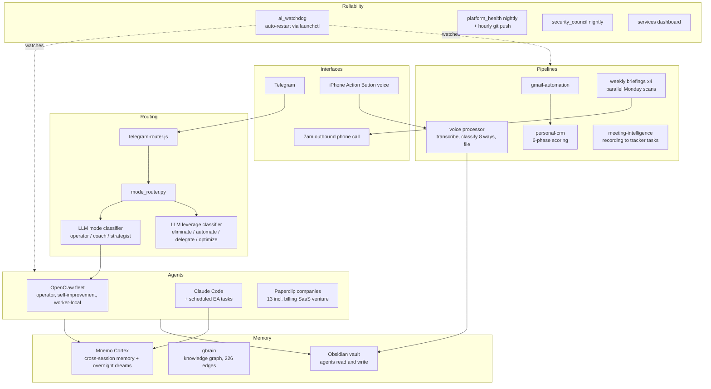

# The Machine

62 scheduled services, one Mac Studio, running my work, health,
relationships, and two software ventures. This repo is the map: what runs,
how the pieces connect, and which parts have public code.

The configs and data stay private for obvious reasons. The architecture,
the design decisions, and a good amount of the code do not. Where a
component has a public repo, it is linked.

## The whole thing on one page

Local models (Ollama, MLX) handle mechanical work at zero marginal cost.
Judgment tasks escalate to cloud models by explicit routing policy. The
split is benchmarked, not vibes: local decode is fast enough for
classification and transcription; reasoning goes to Claude.

## Case studies

The two stories that explain how this machine came to exist:

- [The Assessment That Became an Operating System](case-studies/01-assessment-driven-agents.md) -
  how a psychometric profile became the design constraints for an agent fleet
- [Every Agent Wakes Up Knowing What the Others Did](case-studies/02-memory-spine.md) -
  building cross-agent memory, and everything that broke on the way

## The systems

### 1. Memory spine
Every AI session starts knowing what previous sessions learned. Four
Claude Code hooks wire it: session start pulls context, a pre-search hook
checks the local knowledge base before any web search, post-tool activity
syncs back, session end audits. An overnight job synthesizes the day
across all agents, so each one wakes up briefed on what the others did.
Built on Mnemo Cortex and gbrain (both third-party open source; I run,
integrate, and extend them, I did not write them).

### 2. Message routing
One Telegram thread is the interface to everything. Each message hits two
LLM classifiers before any conversation logic: what mode does this need
(operator, coach, strategist), and what leverage class is it (eliminate,
automate, delegate, optimize). The router maps the answer to an agent and
a model. Public code: [personal-scripts](https://github.com/JustinTSmith/personal-scripts)
(`mode_router.py`, `mode_classifier_llm.py`, `telegram-router.js`).

### 3. Voice pipeline
One press of the iPhone Action Button. Audio lands in iCloud, a watcher
transcribes it, an LLM classifies it into one of 8 categories, and it
files itself into the right vault folder. Seconds, no manual filing.
Public code: `obsidian_voice_processor.py` in personal-scripts.

### 4. Briefing chain
The same intelligence, delivered where I will actually consume it: a
Telegram message at 6am, an outbound phone call at 7am (script reads the
vault, rewrites in a coach persona, synthesizes audio, Twilio dials), and
four parallel weekly scans every Monday covering AI infrastructure,
sales signals, competitors, and client verticals. Public output:
[weekly-briefings](https://github.com/JustinTSmith/weekly-briefings).
Public code: `twilio_morning_call.py` in personal-scripts.

### 5. Relationship pipeline
Gmail and Calendar feed a 6-phase pipeline: fetch, hard filters, AI
classification, scoring, and a learning loop that remembers every
correction. Weekly digest, monthly iMessage relationship analysis,
automated birthday outreach drafted from real communication history.
Public code: [personal-crm](https://github.com/JustinTSmith/personal-crm).

### 6. Life OS
Identity-driven daily planning: tasks scored against a weighted value
hierarchy, energy-gated operating modes (RECOVERY / BUILD / SPRINT), one
primary objective per day, weekly review. The scoring is deterministic
Python; the reasoning is an LLM following a runbook. Public code:
[Life-Operating-System](https://github.com/JustinTSmith/Life-Operating-System).

### 7. Meeting intelligence
Recordings are polled, transcripts extracted, action items pulled with
owners and dates, tasks created in the tracker. No manual review step by
design.

### 8. Agent companies
13 companies on Paperclip, each a workspace where agents hold roles and
work issues, including the billing SaaS I am building. I wrote the
OpenRouter adapter that gives every agent a real multi-turn tool-calling
loop, API tools, and approval gating.

### 9. Self-healing layer
A watchdog daemon monitors the AI services and restarts them through
launchctl when they die. Nightly platform health checks commit their
reports hourly. A nightly security review scans for drift. Two live
dashboards show the fleet. The design goal: I should find out something
broke from a log entry, not from silence.

### 10. Local inference
Ollama and MLX serve local models for classification, transcription, and
TTS ([qwen3-tts](https://github.com/JustinTSmith/qwen3-tts), plus a
[voice finetuning pipeline](https://github.com/JustinTSmith/voice-finetune)).
Benchmarked against each other before choosing what runs where.

## Numbers

- 62 registered LaunchAgents and cron jobs
- 14 services resident in memory right now (agents, gateways, databases,
  dashboards)
- 4 parallel weekly intelligence scans
- 8 voice-note categories, filed automatically
- 3 redundant triggers on the voice pipeline alone

## What I learned building this

- Watchdogs are not optional. Anything that runs unattended will
  eventually die silently; the question is whether you designed for it.
- Memory changes agent behavior more than model choice does. A mid-tier
  model that remembers last week beats a frontier model with amnesia for
  most daily work.
- Route by classification, not by app. One inbox, one thread, one router
  beats twelve apps.
- Local-first is an economics decision, not an ideology. Classification
  and transcription are free at the margin; judgment is worth paying for.
