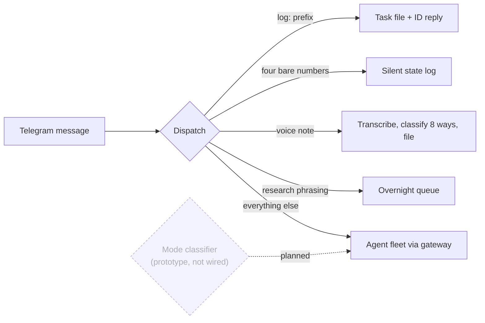

# The Assessment That Became an Operating System

In January 2025 I got back the results of a psychometric assessment. I had
spent two years as Director of Product at the company that makes it, so I
knew exactly what most people do with these reports: read them, feel seen,
file them. Maybe revisit before a performance review.

I fed mine to an AI instead. Fourteen months later, it is the design spec
for a fleet of agents that runs my days.

## The insight is in the tensions

An assessment scores you on dozens of dimensions. Read them separately and
you get a flattering list of strengths and a to-do list of gaps. That is
where most people stop, and it is worthless for building anything.

The value is in the pairs that fight each other.

I score 95 on Full Accountability and 13 on Establishing Order. Feel the
shape of that combination: I feel personally responsible for everything,
and I have almost no natural ability to sequence the work. The weight
never finds structure on its own. Every missed deadline lands as a
personal failure rather than a planning problem, and no amount of trying
harder fixes it, because trying harder is the 95 doing what it always
does.

You cannot coach that away with a productivity book. But you can build
for it.

I score 80 on Focus on Others and 80 on Self-Sufficiency. The caring is
real, and the reaching out never happens. Two strengths, one dead
relationship at a time.

I score 28 on Logic and Data against 71 on Thinking Conceptually. Ideas
arrive fast and evaluation of them does not. Left alone I will generate
fifty ideas, chase the most emotionally compelling one, and never rank
the other forty-nine.

Each of those tensions became a system requirement.

## What got built against each tension

**Accountability 95 x Establishing Order 13** became forced external
capture. Every agent in my system converts loose talk into structure
without being asked. Say "I should probably rethink onboarding" in my
Telegram thread and the operator agent answers with an owner, a deadline,
and a success metric. A `log:` prefix creates a timestamped task and
replies with nothing but a task ID. The rule is absolute: nothing I say
that implies work is allowed to stay ambient. The system carries the
sequencing so the accountability has somewhere to land.

**Focus on Others 80 x Self-Sufficiency 80** became relationship
automation. A pipeline reads my sent mail and calendar, scores every real
relationship on recency, frequency trend, and reciprocity, and surfaces
who is drifting. Birthday messages draft themselves from actual
communication history, calibrated to how close we really are. I still do
the caring. The system does the reaching.

**Logic and Data 28** became an overnight research queue. Ideas logged
during the day go into a queue instead of into my attention. At 2am an
agent works through them: web research, structured trade-off analysis,
synthesis against my knowledge base. By morning each idea is one
paragraph with a recommendation. One of those overnight ideas, logged as
a single sentence about psychiatrist billing in Canada, is now PsychBill,
a SaaS venture with a PRD and a revenue model.

## The router

All of this arrives through one Telegram thread. Four bare numbers in a
row log mood, energy, stress, and anxiety silently, no reply. A voice
note from one press of the iPhone Action Button gets transcribed,
classified into one of eight categories, and filed into my vault in
seconds.

I also built a classifier-based router for that thread: two LLM passes
per message, one choosing the mode the message needs (operator, coach,
strategist), one deciding what should happen to the work itself
(eliminate, automate, delegate, optimize), mapping the pair to an agent
and a model. Honest status: it is a prototype and not in the live path.
Messages reach the fleet through the gateway today, and the router's
model map went stale after I wrote it. I describe it because the design
still looks right to me and I intend to revive it, not because it is
running.

The design principle across all of it: capture must be cheaper than
avoidance. The moment logging something costs more than ignoring it, a
person with my profile stops logging.

## The scorer does not trust me

The daily planner is deterministic Python, not an LLM being agreeable.
Tasks are scored against a weighted hierarchy in which vitality work
carries twice the weight of building work. When my logged energy runs low
for three consecutive days, non-vitality tasks lose points and vitality
tasks gain them. The system literally devalues my ambitions when my body
is depleted, because I have a documented history of overriding my own
recovery, so the override had to move somewhere I cannot charm it.

Operating modes are derived, not chosen. Seven days of logged data decide
whether the week runs in RECOVERY (2 tasks per day) or BUILD (4 tasks).
There is a SPRINT mode defined in the config. Here is an honest detail I
find funny now: no code path selects SPRINT automatically. The system I
built to protect me from myself has never once volunteered to let me
sprint.

## What broke

Plenty. The first version of the daily loop was pure LLM and drifted:
agreeable, forgetful of its own constraints, easy to talk out of a
recovery day. The fix was the split that defines the current
architecture: the LLM does reasoning and conversation, deterministic code
owns scoring, gates, and memory. An agent can be argued with; a scoring
function cannot.

The pre-v2 code is still in the repo and crashes on import. I keep it as
history. It is the version of me that thought the model just needed
better instructions, before I understood that the model needed fewer
decisions.

## Why this matters beyond me

Every company doing AI transformation is asking some version of "how do
we get agents to behave usefully for this specific human or team." The
answer I keep arriving at: behavioral data beats preference surveys. My
agents did not get good because I told them what I like. They got good
because a validated assessment told them where I predictably fail, and
the failure modes became requirements.

I ran product at an assessment company and never once saw the instrument
used this way. That gap, between what behavioral science knows about a
person and what their software does with it, is one of the more
interesting product frontiers I know of. I built one end of the bridge
by hand. The other end is a company.

Public code: the scoring engine and runbook are open at
[Life-Operating-System](https://github.com/JustinTSmith/Life-Operating-System),
the router at [personal-scripts](https://github.com/JustinTSmith/personal-scripts),
the whole machine mapped at [systems](https://github.com/JustinTSmith/systems).
