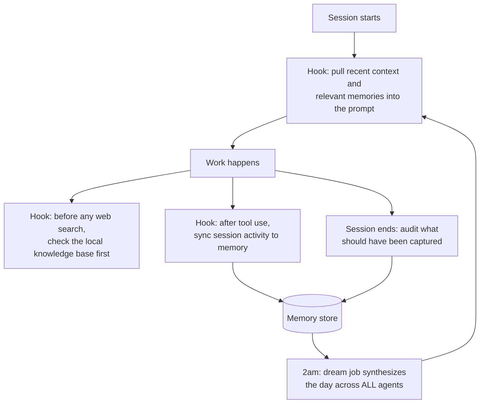

# Every Agent Wakes Up Knowing What the Others Did

There is a moment everyone who works with AI daily eventually hits. You
open a fresh session, and the brilliant collaborator from yesterday has
never met you. The decision you reached at 11pm, the approach you ruled
out after an hour of dead ends, the client detail that changes everything:
gone. You are paying frontier-model prices for a colleague with amnesia.

Multiply that by a fleet. I run agents across Claude Code, OpenClaw, and
Paperclip. Without shared memory they are not a team; they are a row of
brilliant strangers, each rediscovering my life from scratch, sometimes
contradicting each other before breakfast.

The memory spine is what I built instead. Or more precisely, what I
assembled, wired, and then fought into reliability. Two open-source
projects sit at the core: Mnemo Cortex for session memory and gbrain for
the knowledge graph. I did not write them, and this case study is not a
claim that I did. What I built is the nervous system around them, and
that turned out to be where all the hard problems live.

## The architecture

Four hooks wire memory into every Claude Code session, at the exact
moments a session leaks knowledge:

The session-start hook means I never explain context twice. The
pre-search hook is my favorite economic decision in the whole system:
before any agent searches the web for something, it is forced to check
whether we already know it. My own knowledge base outranks Google, which
is both a cost optimization and a quiet statement about whose judgment
accumulates.

The overnight job is where it becomes a team. At 2am, a synthesis pass
reads what every agent did that day: what got built, what got decided,
what is blocked, what was learned. Each agent's next session starts with
that brief. The coding agent knows the research agent ruled something
out. The operator knows what shipped overnight. I stopped being the
message bus between my own tools.

## What broke, because this is the real story

Assembling open-source memory infrastructure is an afternoon. Making it
trustworthy took months, and every lesson came from a failure.

**The search that lied.** gbrain's search command returned confident
results that had nothing to do with the query, and returned them instead
of saying "no match." Verbatim terms that existed in three pages
retrieved an unrelated page. I documented the defect, switched every
workflow to the semantic query path, and wrote the workaround into the
operating instructions every agent loads. Lesson: in memory systems, a
wrong answer is worse than no answer, because nobody double-checks their
own memory.

**The graph with zero edges.** The knowledge graph ran for weeks with no
links between pages. Every page was an island, which quietly defeats the
point of a graph. The extractor was not broken; it was strict. My pages
used shorthand wiki-links, and the resolver wanted full paths. One
configuration change later, the same extractor built 226 edges from the
same pages. Lesson: before concluding a system is broken, check whether
it is just pedantic. The difference matters, because one gets fixed with
config and the other gets replaced.

**The format that failed silently.** Timeline entries only parsed in one
exact markdown shape: bolded date, pipe, source, dash, summary. Anything
else was silently ignored, no error, no log. I found out by noticing
absences, which is the worst way to find anything out. The fix was
boring and effective: standardize on the one confirmed format and route
all writes through a CLI that cannot produce the wrong shape.

**The two bots that fought over one phone number.** For a while, memory
capture from my Telegram thread died randomly. The cause: two services
polling the same bot token, kicking each other off in a loop. The fix
involved killing one service, rotating a token that had leaked into ten
places, and writing down a rule I now apply everywhere: one channel, one
owner, no exceptions.

**The retirement.** An earlier component of the spine, a Postgres-based
fact store, worked well enough that I built 22 tools against it. I
removed all of it this month and rewired everything to the graph,
because running two sources of truth is how you end up with zero. Killing
working infrastructure you built is a specific kind of discipline, and
it is the one that keeps a one-person system from becoming a museum.

## The result

Fourteen services keep this loop alive right now: the memory server, the
sync jobs, the dream job, the gateway, the watchdogs that restart any of
them that die. When I open a session anywhere in the fleet, it knows what
happened yesterday, what we decided, and what we already tried.

The unglamorous truth of AI infrastructure is that the model is the easy
part. Memory is a distributed-systems problem wearing a productivity
costume: sync, dedup, silent failure, split brain, ownership. Those are
the problems I actually solved, and none of them required training a
model. They required treating my own attention as the scarce resource
and building accordingly.

Third-party foundations, with credit: [Mnemo Cortex](https://github.com/GuyMannDude/mnemo-cortex)
and gbrain, both open source. The wiring, hooks, workarounds, and
operating discipline described here are mine. The full machine is mapped
at [systems](https://github.com/JustinTSmith/systems).
