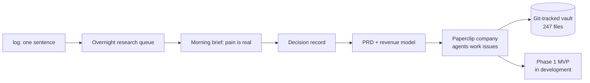

# One Sentence In, One Company Out

Some time last winter I logged a single sentence into my Telegram thread:
something about psychiatrist medical billing in Canada. I did not research
it. I did not open a browser tab. I typed one line with a `log:` prefix,
got back a task ID, and went on with my day.

That sentence is now PsychBill: a billing automation venture with a PRD, a
bottom-up revenue model, a git-tracked knowledge vault, and an AI agent
company doing parts of the work. This case study follows the sentence
through the machine, because the machine is the point. Anyone can have an
idea about medical billing. The interesting part is what happens in the
fourteen hours after you have it.

## Why a queue exists at all

I generate ideas quickly and evaluate them badly. That is not modesty; it
is a measured result on a psychometric assessment I have written about
[elsewhere](01-assessment-driven-agents.md). Left unassisted, I chase
whichever idea is most emotionally alive and the other forty-nine die in
a notes app.

So ideas do not get my attention. They get a queue. At 2am, an agent
works through everything logged that day: live web research, a structured
pass on trade-offs and failure modes, synthesis against my knowledge
base. By morning, each idea is a short brief with a recommendation. Most
briefs conclude "interesting, not now," and that conclusion costs me
nothing. I slept through it.

The billing idea came back different. The overnight brief said, in
effect: the pain is real, quantified, and structural, and the incumbents
are structurally unable to address it.

## What the research found

The numbers that survived scrutiny, from the PRD and the March 2026
revenue model:

- Ontario psychiatrists in private practice spend 4 to 8 hours per week
  on billing administration. At a conservative $300 per hour, that is
  $6,000 to $12,000 per month of unpaid time per physician.
- The root causes are structural: OHIP's psychiatric fee schedule is one
  of the most complex in the province; third-party payers (LTD, WSIB,
  DVA) each use different claim formats; rejected claims go unrecovered
  because resubmission effort exceeds the claim value; telepsychiatry
  added a fee-code layer existing tools have not addressed.
- The dominant billing tools were built for family physicians. They help
  you submit claims. They do not help you decide what to bill, and for a
  psychiatrist that decision is the most financially consequential one of
  the day.
- Serviceable market: roughly 3,500 psychiatrists. Base case at 12%
  penetration and $249 per month is 420 customers and $1.26M ARR by year
  three. The Dr. Bill benchmark (a $7M Series A built on roughly 20,000
  physicians) validates the category; specialty depth is the wedge.

A market of 3,500 people sounds small until you notice it is small enough
to dominate and dense enough that word of mouth is the channel.

## The embarrassing middle part

The venture has had three names. It entered the world as CodeWell, spent
a while as MindBillAI, and settled as PsychBill. All three still exist as
companies inside my agent infrastructure, which I keep as a fossil record
of how naming actually goes.

I include this because case studies that skip the flailing are
advertisements. The naming churn was cheap because everything else was
already systematized: the research, the PRD, the model did not need to be
redone each time the label changed.

## Building inside an agent company

PsychBill development runs inside Paperclip, where the venture is a
company staffed by agents that hold roles and work issues. A stakeholder
analyst agent works research issues. Routine checks run on schedules and
close their own tickets when there is nothing to report. The knowledge
vault is git-tracked: 247 markdown files of fee-schedule analysis,
competitive strategy, and clinical workflow notes, with commit history.

I wrote the OpenRouter adapter this setup runs on, which gives every
agent a real tool-calling loop against the company's API: read issues,
post comments, update status, open sub-issues, request approval before
anything consequential. The human owns judgment and clinical accuracy;
the agents own coverage and cadence.

## Where it honestly stands

Pre-revenue. Phase 1 MVP in active development: code recommendations
from session metadata, post-discharge premium window tracking (the 4, 8,
and 12 week windows psychiatrists routinely miss), and claim scrubbing
before submission. No customers yet, and I say that plainly because the
credibility of everything above depends on not inflating this part.

What I can already defend: the fastest path I know from "stray thought"
to "investable analysis" runs through infrastructure, not inspiration.
The idea cost one sentence. The research cost one night of someone
else's compute. The conviction came from numbers that held up, and the
build is happening inside a system where showing up every day is the
machine's job, not my mood's.

That pipeline is repeatable. PsychBill happens to be the sentence that
survived it.
