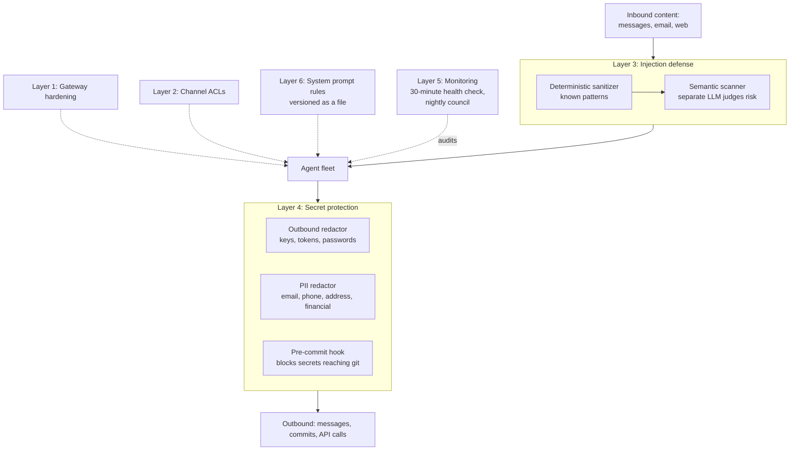

# I Gave Agents My Email and Shell Access. Then I Designed for It.

There is a moment in building an agent fleet where you stop and take
inventory of what you have actually handed out. Mine went roughly: these
agents can read my inbox, write to my files, execute shell commands,
reach the network, and post as me in a chat I read every day. Any of
them can be reached by content I did not write, because reading the
internet is the job.

That is not a hypothetical attack surface. That is a production system
with my life in it, assembled one convenient integration at a time.

So I designed a security posture. Not because anything catastrophic
happened, but because an audit told me small things already had, and the
gap between "small things" and "large things" is mostly time.

## What the audit found

Two findings worth naming, because they set the design:

**Credentials had spread.** A single bot token had propagated into
roughly ten locations: config files, environment files, scripts, logs,
backup copies of all of the above. No breach, but the blast radius of one
leaked string had grown quietly for months. Rotating it meant hunting
every copy.

**A service failed silently for days.** Two processes polled the same
messaging bot, and the platform allows exactly one. They knocked each
other offline in a loop. From the outside it looked like the assistant
had simply gone quiet, which is indistinguishable from having nothing to
say. I found it by noticing an absence.

Neither is exotic. Both are the ordinary way personal infrastructure
decays: secrets sprawl and failures go unobserved. The posture I built
targets exactly those two decay modes.

## The six layers

Two of these are worth more than a diagram box.

## Layer 3: why the scanner does not judge for itself

Prompt injection defense runs in two stages. The first is a
deterministic sanitizer that catches known patterns cheaply. Anything
that survives goes to a semantic scanner, which asks a language model to
classify the content: a risk score from 0 to 1, an attack type
(role play, instruction override, social engineering, data injection),
and a block recommendation. Above a configurable threshold, it blocks.

The important decision is not that a model does the judging. It is
*which* model, in which context.

The scan runs as a separate API call, in a fresh context, with the
suspicious content quoted as data inside an analysis prompt. The agent
that would have received the content never sees it unless it passes.

This matters because the alternative is incoherent. If you ask an agent
to evaluate whether the message it just read was an attack, you have
already given the attack its opportunity: the content is in the context,
and the same instruction-following behavior you are testing is the
behavior doing the testing. Self-assessment is not a control. An agent
cannot be trusted to assess an attack aimed at itself, any more than a
compromised host can be trusted to report that it is compromised.

Separating the judge from the target is the entire idea. Everything else
is tuning.

The honest limits: a determined novel attack can still pass a classifier,
the scan costs latency and a token spend on every suspicious message, and
truncating content for analysis means a long document could hide payload
past the cutoff. It raises the floor. It is not a proof.

## Layer 4: assume the agent will say the wrong thing

Secret protection runs on the assumption that an agent will eventually
try to send something it should not: a key pasted into a debug message,
a token echoed in an error, a phone number in a summary. The controls sit
at the exits rather than relying on agent judgment:

- An **outbound redactor** pattern-matches API keys, tokens, and
  passwords out of anything an agent sends
- A **PII redactor** strips emails, phone numbers, addresses, and
  financial identifiers
- A **pre-commit hook** blocks secrets from reaching git at all, which is
  the lesson from the credential sprawl finding: the cheapest place to
  stop a secret is before it is written down

The design principle: put controls where the data leaves, not where the
decision is made. Decisions are probabilistic. Exits are countable.

## The nightly council

Once a night, a security council runs the whole posture. Six static
collectors work in parallel, each answering a narrow question: are
secrets exposed, are file permissions right, what is the code execution
surface, has config drifted, what does git history reveal, are there
anomalies in the logs.

Their combined evidence then goes to four AI analysts with deliberately
different jobs. **Red Team** looks for what an attacker would use.
**Blue Team** evaluates whether the existing defenses actually work.
**Data Privacy** asks what personal data is exposed and to whom.
**Operational Realism** asks which risks matter given how the system is
actually run, as opposed to how it is documented.

That fourth perspective is the one I would keep if I could only keep
one. Red teams generate findings faster than any individual can act on
them, and an unprioritized security report is a document you stop
reading by week three. Operational Realism is what turns a list into a
queue.

A synthesis pass merges everything into a numbered digest delivered to a
dedicated channel. Each item supports `--drill N` for full evidence and
`--heal N` to execute the fix. Findings I cannot act on in one command
are findings I will not act on.

## What I would tell a team doing this

Most of what I built is not novel. It is the ordinary security playbook,
applied to a category of system that usually gets none of it, because
agent infrastructure grows by convenience and nobody schedules the audit.

Three things transfer:

1. **Separate the judge from the target.** Any component asked to
   evaluate content is compromised by holding that content. This applies
   well beyond injection: it is the same reason you do not let a service
   grade its own health check.
2. **Control the exits, not the decisions.** You cannot make a
   probabilistic system reliably choose not to leak. You can enumerate
   the places data leaves and filter every one.
3. **A finding you cannot act on in one step is not a finding.** Every
   monitoring system I have seen fail, failed by producing more signal
   than anyone would triage. Drill and heal are not conveniences; they
   are what makes the alerts survive contact with a busy week.

You can watch the two-stage scan and the test suite run in
[demos/01-injection-defense](../demos/01-injection-defense/), which
renders itself from a script rather than a recording.

The uncomfortable version of this case study: I built a fleet of agents
with broad access first, and designed the security posture second. That
is the honest sequence, and it is the same sequence most companies are
following with agents right now. The difference worth anything is
whether the second step ever happens.

The machine is mapped at [systems](https://github.com/JustinTSmith/systems).
