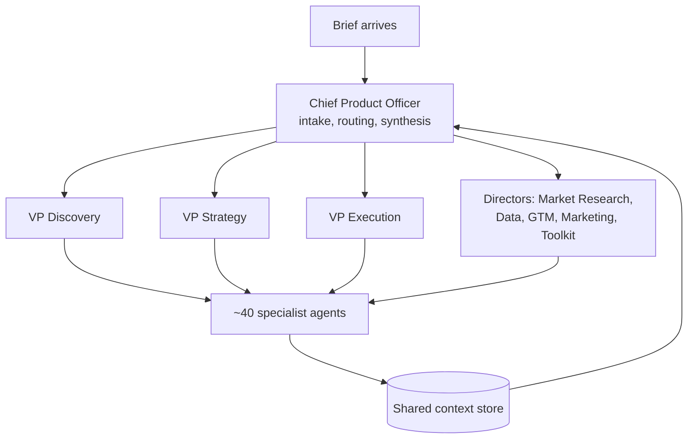

# I Built the Product Org I Used to Hire

For fifteen years my job was assembling product organizations: hiring the
PMs, defining the operating model, deciding which specialist role was
worth a headcount and which was a hat somebody already wore. At Officevibe
I hired three of the four product managers and built the workflow they
ran on.

In 2025, between roles and caring for a newborn, I built one out of
agents instead. Forty-eight of them, arranged in an actual org chart,
with a Chief Product Officer at the top.

It is called Product Compass Consulting. Naming it like a firm was not a
joke. The question I was testing is one every product leader is about to
face: how much of a product organization is judgment, and how much is
craft that can be specified?

## The org chart is the architecture

The Chief Product Officer agent does not do product work. It does intake,
routing, and synthesis, exactly like the good ones do. Its instructions
say it delegates to eight direct reports by domain:

- **VP of Product Discovery** — ideation, assumption testing, experiments,
  user research
- **VP of Product Strategy** — vision, business models, competitive
  analysis, pricing
- **VP of Product Execution** — PRDs, OKRs, roadmaps, sprints, stories
- **Director of Market Research** — personas, segmentation, journey mapping
- **Director of Data Analytics** — SQL, A/B tests, cohort analysis
- **Director of Go-to-Market** — GTM strategy, growth loops, battlecards
- **Director of Marketing** — positioning, naming, metrics
- **Director of PM Toolkit** — legal documents, proofreading, editing

Beneath them sit the specialists: PRD Writer, Market Sizing Analyst,
Pricing Strategist, Competitive Intelligence Analyst, OKR Specialist,
Roadmap Specialist, Vision Strategist, User Researcher, Journey Mapper,
Persona Specialist, North Star Analyst, Opportunity Solution Tree
Analyst, Assumption Analyst, Experiment Designer, Sprint Manager, Release
Manager, Risk Analyst, QA Specialist, Story Writer, SQL Analyst,
Battlecard Writer, Legal Specialist, Editor, and about twenty more.

The CPO's routing principle is the same sequence I would run with humans:
Discovery, then Strategy, then Execution, then GTM. Its instructions tell
it to lean on the team rather than doing the work itself, which is
advice I have given every senior PM I ever hired and watched most of them
ignore.

## The four-part contract

Every agent's instructions answer the same four questions, and I think
this is the most portable thing in the whole build:

1. **Where work comes from**
2. **What you produce**
3. **Who you hand off to**
4. **What triggers you**

That is it. No personality, no verbose preamble. The Legal Specialist's
instructions say it receives requests from the Director of PM Toolkit,
produces NDAs and privacy policies with flagged clauses, hands off to the
Editor for proofreading, and always recommends the client have documents
reviewed by qualified counsel.

Those four questions are what turns a collection of agents into an
organization. A group chat of capable models produces overlapping,
unowned output. Agents with defined inputs, outputs, handoffs, and
triggers produce a workflow. It is the same reason a real team needs
role clarity more than it needs talent.

The boundary in that Legal Specialist example is worth pausing on. "Always
recommend qualified human counsel" is written into the role, not hoped
for. If you want an agent to stay inside a line, the line has to be part
of its job description.

## What I learned about my own profession

**Craft specifies well. Judgment does not.** The specialist roles work.
A PRD Writer with a clear brief produces a usable PRD. A Market Sizing
Analyst produces a defensible TAM with stated assumptions. These are
crafts with known structure, and structure is exactly what you can put in
a prompt.

What does not transfer is knowing which question to ask. The org will
happily produce a beautiful competitive analysis of the wrong market. It
has no instinct for "this brief is wrong," which is most of what senior
product judgment actually is. The CPO agent routes well and synthesizes
well; it does not push back on the premise, and pushing back on the
premise is the job.

**Handoffs are where quality is won or lost**, in agent orgs exactly as in
human ones. My early version had specialists writing directly to output.
Adding the Editor step to the Toolkit chain improved the result more than
any prompt tuning I did, which is a lesson I already knew from running
teams and somehow had to relearn.

**The org runs on models chosen by measurement.** I started it entirely on
local open-weight models to keep the cost near zero. That failed in a
specific and instructive way, documented in
[Cheap Models, Expensive Mistakes](05-local-model-routing.md): the local
models handled mechanical work fine and could not carry judgment. So the
org now routes by job class, frontier models where judgment lives, local
where the work is gathering and formatting. Agents call tools through a
small API surface with approval gating on anything consequential.

## The honest limits

Nobody is paying for Product Compass output. It has produced real
artifacts I have used, including work on my own billing venture, but it
has not been tested against a client who would reject it. Treat every
claim here as "this ran," not "this sold."

The org is also over-built relative to its throughput. Forty-eight agents
is more organization than one person's workload justifies. I built the
full chart because I wanted to see where the specification stopped
working, and the answer turned out to be interesting enough to justify
the excess.

And a number worth correcting: I have described this as a 39-agent org in
older material. Thirty-nine was an earlier count. There are 48 configured
today, and I would rather be precise than impressive.

## Why this matters to a company

Every product organization is about to run some version of this
experiment. The useful finding is not that agents can write PRDs. It is
where the line falls.

The line falls at premise-setting. An agent org can execute the craft of
product management at surprising depth, and it cannot tell you that you
are solving the wrong problem. That means the near-term shape is not
fewer product people, it is fewer people doing production work and more
value concentrated in whoever sets the brief.

I spent fifteen years hiring for the craft. Building this convinced me
the next fifteen are about hiring for the judgment, and that the leverage
of a good product leader just went up rather than down.

The machine is mapped at [systems](https://github.com/JustinTSmith/systems).
